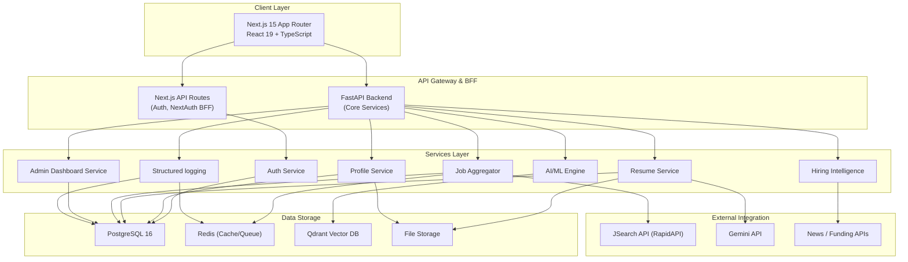

# 🚀 JobFinder Pro

An AI-powered, end-to-end job search and matching platform featuring a Next.js frontend, FastAPI backend, PostgreSQL database, Redis task queue, and Qdrant vector database for semantic match analysis.

---

## ✨ Features

- **OAuth & Auth.js v5 Integration**: Safe credentials and social login (Google, GitHub, LinkedIn).
- **Interactive Resume Editor**: Built on top of Tiptap (ProseMirror), with real-time PDF preview and multiple ATS-friendly templates.
- **Gemini AI Resume Parsing**: Upload a PDF or Word document and automatically parse your experience, skills, and education.
- **ATS Analyzer & Scoring Engine**: Get constructive, real-time feedback and keyword optimization recommendations based on your resume.
- **Semantic Job Matching**: Powering search and recommendation using Qdrant vector similarity search on embeddings generated via Google Gemini.
- **Hiring Intelligence Dashboard**: Automated web scraping, tracking of newly funded startups, and company hiring trends.
- **Activity Log & Auditing**: Detailed request-level logging and activity feed for compliance and admin oversight.
- **Dockerized Architecture**: Simple, consistent local setup via Docker Compose.

---

## 🏗️ System Architecture



---

## 🛠️ Technology Stack

| Component | Technology | Description |
|:---|:---|:---|
| **Frontend** | Next.js 15 (App Router), React 19, TypeScript | Premium modern UI client |
| **Styling** | Vanilla CSS / Tailored HSL Colors | Flex/Grid layouts, glassmorphism, dark/light theme |
| **State Management** | Zustand | Global client state |
| **Auth** | Auth.js v5 (NextAuth) | Credentials + Social OAuth logins |
| **Rich Text Editor** | Tiptap (ProseMirror) | Professional resume editing pane |
| **Charts & Analytics** | Recharts | Visualization of user stats & logs |
| **Backend API** | FastAPI, Uvicorn, Pydantic v2 | High-performance Python async backend |
| **ORM & Migrations** | SQLAlchemy (Async), Alembic | Relational database mapping & versioning |
| **Message Queue** | Celery + Redis | Asynchronous background scrapers & email jobs |
| **Vector DB** | Qdrant | Fast vector search for semantic job-to-resume matchmaking |
| **AI Model** | Google Gemini (Gemini SDK) | Content parsing, ATS feedback, embedding extraction |
| **Dev Container** | Docker / Docker Compose | Complete environment packaging |

---

## 📁 Project Structure

```
job-finder/
├── frontend/                        # Next.js 15 Application
│   ├── public/                      # Static assets
│   ├── src/
│   │   ├── app/                     # Next.js App Router folders
│   │   ├── components/              # UI, Layout, Resume, and Job components
│   │   ├── lib/                     # API client, NextAuth configs, utilities
│   │   ├── stores/                  # Zustand stores
│   │   └── types/                   # TypeScript schemas
│   ├── Dockerfile
│   └── package.json
│
├── backend/                         # FastAPI Python Backend
│   ├── app/
│   │   ├── main.py                  # App initialization & entrypoint
│   │   ├── config.py                # Pydantic environment configuration
│   │   ├── database.py              # Async SQLAlchemy connection session
│   │   ├── models/                  # SQLAlchemy ORM schemas
│   │   ├── schemas/                 # Pydantic validation models
│   │   ├── routers/                 # API controllers
│   │   ├── services/                # Business logic (ATS, resume parsing)
│   │   ├── workers/                 # Celery scraper and indexing tasks
│   │   └── utils/                   # Gemini embeddings and PDF helpers
│   ├── alembic/                     # Database migration control scripts
│   ├── Dockerfile
│   └── requirements.txt
│
├── docker-compose.yml               # Service orchestrator (Postgres, Redis, Qdrant, Apps)
├── .env.example                     # Environment variables template
└── README.md                        # Master repository documentation
```

---

## 🚀 Getting Started

### Prerequisites

Ensure you have the following installed locally:
- [Docker & Docker Desktop](https://www.docker.com/products/docker-desktop/)
- [Node.js (v20+)](https://nodejs.org/) (optional, if running frontend outside Docker)
- [Python (3.12+)](https://www.python.org/) (optional, if running backend outside Docker)

### Environment Configuration

1. Clone the project and copy the environment template to `.env`:
   ```bash
   cp .env.example .env
   ```
2. Open the `.env` file and customize the variables. In particular, supply your API keys:
   - `GEMINI_API_KEY`: Required for AI parsing & ATS grading.
   - `JSEARCH_API_KEY`: Required for fetching real-time job listings (optional; mock fallback is used if empty).
   - `NEXTAUTH_SECRET`: Generate a safe random string.

### Run with Docker Compose (Recommended)

To spin up all services including PostgreSQL, Redis, Qdrant, the FastAPI backend, and Next.js frontend:

```bash
docker-compose up --build
```

- **Frontend client**: [http://localhost:3000](http://localhost:3000)
- **FastAPI backend API**: [http://localhost:8000](http://localhost:8000)
- **Interactive API Docs (Swagger UI)**: [http://localhost:8000/api/docs](http://localhost:8000/api/docs)
- **Qdrant Vector Console**: [http://localhost:6333/dashboard](http://localhost:6333/dashboard)

### Run Locally for Development

#### 1. Setup Datastores via Docker
If you want to edit code locally with instant reload and bypass Docker container volume constraints, start only the backend databases:
```bash
docker-compose up -d postgres redis qdrant
```

#### 2. Run Backend
```bash
cd backend
python -m venv .venv
source .venv/bin/activate  # On Windows use: .venv\Scripts\activate
pip install -r requirements.txt
alembic upgrade head       # Run database migrations
uvicorn app.main:app --reload
```

#### 3. Run Frontend
```bash
cd frontend
npm install
npm run dev
```

---

## 🗄️ Database Schema Summary

The relational database is orchestrated in **PostgreSQL 16**:

- **`users` / `accounts` / `sessions`**: standard NextAuth tables for local signups and social OAuth sessions.
- **`resumes`**: Stores parsed resume structure (JSON + plaintext), templates config, file attachments, and ATS score outcomes.
- **`jobs`**: Normalized scraped schema comprising roles, company details, requirements list, skills needed, salary details, and Gemini embedding IDs.
- **`saved_jobs` / `job_applications`**: User tracking links to save or apply to specific jobs with corresponding resume versions.
- **`hiring_intelligence`**: Feeds tracking funding events, hiring spikes, and industry sentiment.
- **`activity_logs`**: Tracks actions like parsing resumes, searching, saving jobs, and user events.

---

## 🔌 Core API Endpoints

### FastAPI Endpoints

| Method | Route | Description |
|---|---|---|
| **Users** | | |
| `GET` | `/api/v1/users/me` | Fetch user profile detail |
| `PUT` | `/api/v1/users/me` | Update resume profiles |
| **Resumes** | | |
| `GET` | `/api/v1/resumes` | Retrieve all resumes |
| `POST` | `/api/v1/resumes/upload` | Parse PDF/DOCX using Gemini AI |
| `POST` | `/api/v1/resumes/{id}/ats-score` | Grade resume against target keywords |
| **Jobs** | | |
| `GET` | `/api/v1/jobs` | Retrieve/filter crawled jobs |
| `GET` | `/api/v1/jobs/recommended` | Vector search similarity matches based on resume |
| **Intelligence** | | |
| `GET` | `/api/v1/intelligence/funding` | Fetch tracked startup fundings |
| `GET` | `/api/v1/intelligence/trends` | Retrieve hiring trend charts |

---

## 🧪 Verification & Testing

### Automated Checks
Run the verification commands below in your respective directories:

```bash
# Verify Frontend compilation & lints
cd frontend
npm run lint
npm run build

# Run Backend unit tests
cd backend
pytest
```