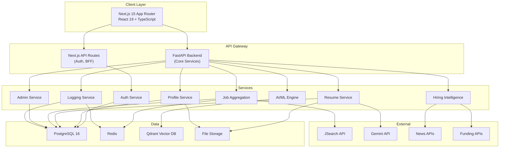

# 🚀 JobFinder Pro — Full Implementation Plan

> AI-powered job search platform: Next.js 15 + FastAPI + PostgreSQL + Redis + Qdrant

## Decisions Locked ✅

| Decision | Choice |
|:---|:---|
| **Frontend** | Next.js 15 (App Router, React 19, TypeScript) |
| **Backend** | FastAPI (Python 3.12) |
| **Database** | PostgreSQL 16 |
| **Cache/Queue** | Redis |
| **Vector DB** | Qdrant (semantic job matching) |
| **Auth** | Auth.js v5 (Google, GitHub, LinkedIn OAuth) |
| **LLM** | Google Gemini API |
| **Job Data** | JSearch API (RapidAPI) + mock fallback |
| **Resume Editor** | Tiptap (ProseMirror) |
| **Charts** | Recharts |
| **Deployment** | Docker Compose |

---

## System Architecture



---

## Project Structure

```
job finder/
├── frontend/                        # Next.js 15 Application
│   ├── public/assets/
│   ├── src/
│   │   ├── app/
│   │   │   ├── (auth)/login/page.tsx
│   │   │   ├── (auth)/signup/page.tsx
│   │   │   ├── (main)/dashboard/page.tsx
│   │   │   ├── (main)/profile/page.tsx
│   │   │   ├── (main)/resume/page.tsx
│   │   │   ├── (main)/resume/editor/page.tsx
│   │   │   ├── (main)/jobs/page.tsx
│   │   │   ├── (main)/jobs/[id]/page.tsx
│   │   │   ├── (main)/intelligence/page.tsx
│   │   │   ├── (admin)/admin/page.tsx
│   │   │   ├── api/auth/[...nextauth]/route.ts
│   │   │   ├── layout.tsx
│   │   │   ├── page.tsx
│   │   │   └── globals.css
│   │   ├── components/
│   │   │   ├── ui/                  # Button, Card, Input, Modal, Badge, etc.
│   │   │   ├── layout/             # Navbar, Sidebar, Footer
│   │   │   ├── auth/               # OAuthButtons, LoginForm, SignupForm
│   │   │   ├── profile/            # ProfileForm, AvatarUpload
│   │   │   ├── resume/             # Editor, Preview, ATSPanel, Templates
│   │   │   ├── jobs/               # JobCard, Filters, Detail, SaveBtn
│   │   │   └── admin/              # StatsCards, Charts, ActivityFeed
│   │   ├── lib/
│   │   │   ├── api-client.ts       # Axios instance for FastAPI
│   │   │   ├── auth-config.ts      # Auth.js edge config
│   │   │   ├── ats-scorer.ts       # Client-side ATS checks
│   │   │   └── utils.ts
│   │   ├── hooks/
│   │   ├── stores/                 # Zustand state
│   │   └── types/
│   ├── auth.ts
│   ├── middleware.ts
│   ├── next.config.ts
│   ├── package.json
│   └── Dockerfile
│
├── backend/                         # FastAPI Python Backend
│   ├── app/
│   │   ├── main.py
│   │   ├── config.py
│   │   ├── database.py
│   │   ├── models/
│   │   │   ├── user.py
│   │   │   ├── resume.py
│   │   │   ├── job.py
│   │   │   └── log.py
│   │   ├── schemas/
│   │   │   ├── user.py
│   │   │   ├── resume.py
│   │   │   ├── job.py
│   │   │   └── log.py
│   │   ├── routers/
│   │   │   ├── users.py
│   │   │   ├── resumes.py
│   │   │   ├── jobs.py
│   │   │   ├── ai.py
│   │   │   ├── admin.py
│   │   │   └── logs.py
│   │   ├── services/
│   │   │   ├── resume_parser.py
│   │   │   ├── ats_scorer.py
│   │   │   ├── job_matcher.py
│   │   │   ├── job_aggregator.py
│   │   │   └── hiring_intel.py
│   │   ├── workers/
│   │   │   ├── job_scraper.py
│   │   │   ├── funding_tracker.py
│   │   │   └── news_crawler.py
│   │   ├── middleware/
│   │   │   ├── logging_middleware.py
│   │   │   └── cors.py
│   │   └── utils/
│   │       ├── embeddings.py
│   │       └── pdf_tools.py
│   ├── alembic/
│   ├── alembic.ini
│   ├── requirements.txt
│   ├── Dockerfile
│   └── .env.example
│
├── docker-compose.yml
├── .env.example
└── README.md
```

---

## Database Schema (PostgreSQL)

### Users & Auth
```sql
CREATE TABLE users (
    id              UUID PRIMARY KEY DEFAULT gen_random_uuid(),
    email           VARCHAR(255) UNIQUE NOT NULL,
    password_hash   VARCHAR(255),
    name            VARCHAR(255),
    image           TEXT,
    summary         TEXT,
    phone           VARCHAR(20),
    location        VARCHAR(255),
    linkedin_url    TEXT,
    github_url      TEXT,
    education       JSONB DEFAULT '[]',
    experience      JSONB DEFAULT '[]',
    skills          JSONB DEFAULT '[]',
    job_preferences JSONB DEFAULT '{}',
    role            VARCHAR(20) DEFAULT 'user',
    provider        VARCHAR(50),
    provider_id     VARCHAR(255),
    email_verified  TIMESTAMPTZ,
    created_at      TIMESTAMPTZ DEFAULT NOW(),
    updated_at      TIMESTAMPTZ DEFAULT NOW(),
    last_login_at   TIMESTAMPTZ
);

CREATE TABLE accounts (
    id                  UUID PRIMARY KEY DEFAULT gen_random_uuid(),
    user_id             UUID REFERENCES users(id) ON DELETE CASCADE,
    type                VARCHAR(50),
    provider            VARCHAR(50),
    provider_account_id VARCHAR(255),
    refresh_token       TEXT,
    access_token        TEXT,
    expires_at          INTEGER,
    token_type          VARCHAR(50),
    scope               TEXT,
    id_token            TEXT,
    session_state       TEXT,
    UNIQUE(provider, provider_account_id)
);

CREATE TABLE sessions (
    id            UUID PRIMARY KEY DEFAULT gen_random_uuid(),
    session_token VARCHAR(255) UNIQUE NOT NULL,
    user_id       UUID REFERENCES users(id) ON DELETE CASCADE,
    expires       TIMESTAMPTZ NOT NULL
);
```

### Resumes
```sql
CREATE TABLE resumes (
    id            UUID PRIMARY KEY DEFAULT gen_random_uuid(),
    user_id       UUID REFERENCES users(id) ON DELETE CASCADE,
    title         VARCHAR(255) NOT NULL,
    raw_file_url  TEXT,
    content_json  JSONB NOT NULL,
    content_text  TEXT,
    parsed_data   JSONB,
    ats_score     FLOAT,
    ats_feedback  JSONB,
    embedding_id  VARCHAR(255),
    is_primary    BOOLEAN DEFAULT FALSE,
    version       INTEGER DEFAULT 1,
    template      VARCHAR(50) DEFAULT 'professional',
    created_at    TIMESTAMPTZ DEFAULT NOW(),
    updated_at    TIMESTAMPTZ DEFAULT NOW()
);
```

### Jobs
```sql
CREATE TABLE jobs (
    id              UUID PRIMARY KEY DEFAULT gen_random_uuid(),
    source          VARCHAR(50) NOT NULL,
    source_url      TEXT NOT NULL,
    source_job_id   VARCHAR(255),
    title           VARCHAR(500) NOT NULL,
    company_name    VARCHAR(255) NOT NULL,
    company_logo    TEXT,
    location        VARCHAR(255),
    job_type        VARCHAR(50),
    work_mode       VARCHAR(50),
    salary_min      DECIMAL,
    salary_max      DECIMAL,
    salary_currency VARCHAR(10) DEFAULT 'INR',
    description     TEXT NOT NULL,
    requirements    JSONB,
    skills_required JSONB DEFAULT '[]',
    experience_min  INTEGER,
    experience_max  INTEGER,
    posted_at       TIMESTAMPTZ,
    expires_at      TIMESTAMPTZ,
    is_active       BOOLEAN DEFAULT TRUE,
    company_funding JSONB,
    hiring_trend    VARCHAR(50),
    embedding_id    VARCHAR(255),
    created_at      TIMESTAMPTZ DEFAULT NOW(),
    updated_at      TIMESTAMPTZ DEFAULT NOW()
);

CREATE INDEX idx_jobs_source ON jobs(source);
CREATE INDEX idx_jobs_skills ON jobs USING GIN(skills_required);
CREATE INDEX idx_jobs_active ON jobs(is_active, posted_at DESC);
```

### Applications & Saved Jobs
```sql
CREATE TABLE saved_jobs (
    id        UUID PRIMARY KEY DEFAULT gen_random_uuid(),
    user_id   UUID REFERENCES users(id) ON DELETE CASCADE,
    job_id    UUID REFERENCES jobs(id) ON DELETE CASCADE,
    saved_at  TIMESTAMPTZ DEFAULT NOW(),
    UNIQUE(user_id, job_id)
);

CREATE TABLE job_applications (
    id         UUID PRIMARY KEY DEFAULT gen_random_uuid(),
    user_id    UUID REFERENCES users(id) ON DELETE CASCADE,
    job_id     UUID REFERENCES jobs(id) ON DELETE CASCADE,
    resume_id  UUID REFERENCES resumes(id),
    status     VARCHAR(50) DEFAULT 'applied',
    applied_at TIMESTAMPTZ DEFAULT NOW(),
    updated_at TIMESTAMPTZ DEFAULT NOW()
);
```

### Hiring Intelligence
```sql
CREATE TABLE hiring_intelligence (
    id            UUID PRIMARY KEY DEFAULT gen_random_uuid(),
    company_name  VARCHAR(255) NOT NULL,
    event_type    VARCHAR(50) NOT NULL,
    headline      TEXT,
    details       JSONB,
    sentiment     VARCHAR(20),
    published_at  TIMESTAMPTZ,
    source_url    TEXT,
    created_at    TIMESTAMPTZ DEFAULT NOW()
);
```

### Activity Logs
```sql
CREATE TABLE activity_logs (
    id            BIGSERIAL PRIMARY KEY,
    user_id       UUID REFERENCES users(id),
    action        VARCHAR(100) NOT NULL,
    resource_type VARCHAR(50),
    resource_id   UUID,
    details       JSONB,
    ip_address    INET,
    user_agent    TEXT,
    created_at    TIMESTAMPTZ DEFAULT NOW()
);

CREATE INDEX idx_logs_user ON activity_logs(user_id, created_at DESC);
CREATE INDEX idx_logs_action ON activity_logs(action, created_at DESC);
```

---

## API Endpoints

### Next.js BFF (Auth)
| Method | Endpoint | Purpose |
|:---|:---|:---|
| `*` | `/api/auth/[...nextauth]` | Auth.js handler |

### FastAPI Backend
| Method | Endpoint | Purpose |
|:---|:---|:---|
| **Users** | | |
| `GET` | `/api/v1/users/me` | Current user profile |
| `PUT` | `/api/v1/users/me` | Update profile |
| `POST` | `/api/v1/users/me/avatar` | Upload avatar |
| **Resumes** | | |
| `GET` | `/api/v1/resumes` | List resumes |
| `POST` | `/api/v1/resumes` | Create resume |
| `PUT` | `/api/v1/resumes/{id}` | Update resume |
| `DELETE` | `/api/v1/resumes/{id}` | Delete resume |
| `POST` | `/api/v1/resumes/upload` | Upload & parse PDF/DOCX |
| `POST` | `/api/v1/resumes/{id}/ats-score` | Run ATS analysis |
| `GET` | `/api/v1/resumes/{id}/export` | Export as PDF |
| **Jobs** | | |
| `GET` | `/api/v1/jobs` | Search jobs |
| `GET` | `/api/v1/jobs/{id}` | Job details |
| `GET` | `/api/v1/jobs/recommended` | AI recommendations |
| `POST` | `/api/v1/jobs/{id}/save` | Save job |
| `DELETE` | `/api/v1/jobs/{id}/save` | Unsave job |
| `POST` | `/api/v1/jobs/{id}/apply` | Apply to job |
| **Intelligence** | | |
| `GET` | `/api/v1/intelligence/funding` | Funded startups |
| `GET` | `/api/v1/intelligence/trends` | Hiring trends |
| **Admin** | | |
| `GET` | `/api/v1/admin/stats` | Dashboard stats |
| `GET` | `/api/v1/admin/users` | User list |
| `GET` | `/api/v1/admin/logs` | Activity logs |
| `GET` | `/api/v1/admin/analytics` | Job analytics |

---

## Build Phases

### Phase 1: Infrastructure Setup
- [ ] Create project directories (frontend/ + backend/)
- [ ] Initialize Next.js 15 with TypeScript
- [ ] Initialize FastAPI with project structure
- [ ] Docker Compose: PostgreSQL, Redis, Qdrant, frontend, backend
- [ ] Prisma/SQLAlchemy models + Alembic migrations
- [ ] Global CSS design system (dark theme, Inter font, glassmorphism)
- [ ] Reusable UI components (Button, Card, Input, Modal, Badge, Avatar)
- [ ] Layout components (Navbar, Sidebar, Footer)

### Phase 2: Auth & Profiles
- [ ] Auth.js v5 config (Google, GitHub, LinkedIn)
- [ ] Login/signup pages with OAuth buttons
- [ ] Route protection middleware
- [ ] User CRUD API (FastAPI)
- [ ] Profile page (view/edit, avatar, education, experience, skills)

### Phase 3: Resume Editor & ATS
- [ ] Tiptap editor with resume sections
- [ ] 3 ATS-friendly templates
- [ ] Split-pane: editor + live preview
- [ ] Resume upload (PDF/DOCX) → parse via Gemini
- [ ] ATS scoring engine (Gemini + keyword analysis)
- [ ] ATS score panel with improvement suggestions
- [ ] PDF export
- [ ] Resume versioning

### Phase 4: Job Aggregation & Search
- [ ] Job source adapter interface
- [ ] JSearch API integration
- [ ] Mock data adapter (200+ jobs)
- [ ] Job normalization pipeline
- [ ] Job search page with filters
- [ ] Job detail page
- [ ] Save/bookmark jobs
- [ ] Application tracking

### Phase 5: AI Matching & Intelligence
- [ ] Qdrant setup + embedding service (Gemini)
- [ ] Resume → embedding on save
- [ ] Job → embedding on ingest
- [ ] Recommendation engine (vector similarity + scoring)
- [ ] "Recommended for you" section
- [ ] Hiring intelligence: funding tracker
- [ ] Hiring intelligence: news crawler
- [ ] Intelligence dashboard page

### Phase 6: Admin, Logging & Polish
- [ ] Logging middleware (all API requests)
- [ ] Activity log model + API
- [ ] Admin dashboard page
- [ ] Stats widgets (active users, growth chart)
- [ ] Job analytics (most popular, openings by source)
- [ ] Activity feed (real-time log)
- [ ] Dark mode toggle
- [ ] Responsive design pass
- [ ] Error handling + loading states
- [ ] README + setup docs

---

## Verification Plan

### Automated
```bash
# Frontend
cd frontend && npm run lint && npm run type-check && npm run build

# Backend
cd backend && pytest tests/ -v

# Docker
docker-compose up -d
docker-compose ps  # all services healthy
```

### Manual
- [ ] Full user flow: signup → profile → resume → ATS → search → save → apply
- [ ] OAuth with all 3 providers
- [ ] Resume editor CRUD + PDF export
- [ ] ATS score changes with resume edits
- [ ] Job search filters work correctly
- [ ] Admin dashboard shows real data
- [ ] Logs recorded for all actions
- [ ] Responsive on mobile/tablet/desktop
- [ ] Dark mode across all pages
